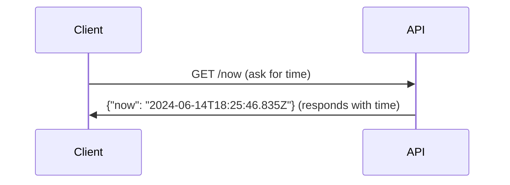

## 🗒️ Summary

(_Summarize the feature you'd like to see implemented concisely. "Add X functionality"_)

---

## 🔍 What problem does this feature solve?

(_Describe the problem this feature would address. "Currently, Y is a limitation, and adding X would solve it"_)

---

## 🎯 What is the proposed solution?

(_Describe how you envision this feature being implemented. "Add a new method for Z"_)

---

## 🚀 Why is this feature valuable to the product?

(_Explain why this feature would improve the product. "This would make the process faster, reduce errors, etc."_)

---

## 📋 Steps to use the feature

(_How will users interact with this feature? Describe the user journey or interface interactions. 
For bonus points, use a user story format, and add a 
[sequence diagram](https://mermaid.js.org/syntax/sequenceDiagram.html) or [flowchart](https://mermaid.js.org/syntax/flowchart.html)_)

(_For example_:

)

---

## 📜 Additional details, mockups, or screenshots

(_If applicable, attach any additional context, mockups, or screenshots that help explain the feature_)

---

(_Automatically adds the feature label for easier tracking_)

/label ~feature
