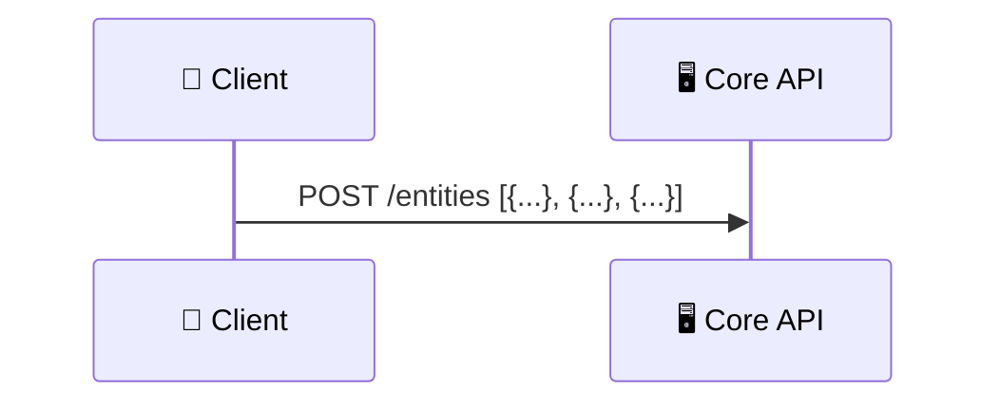
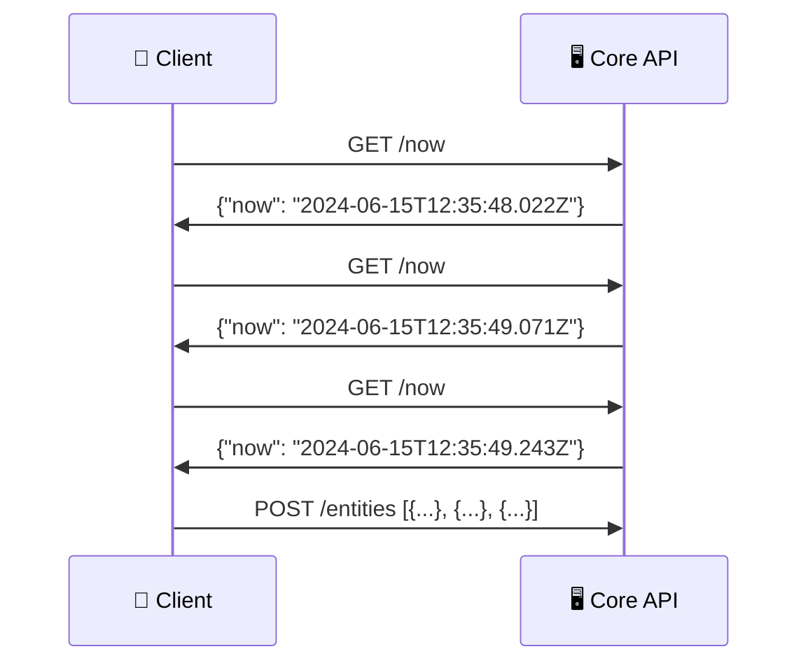
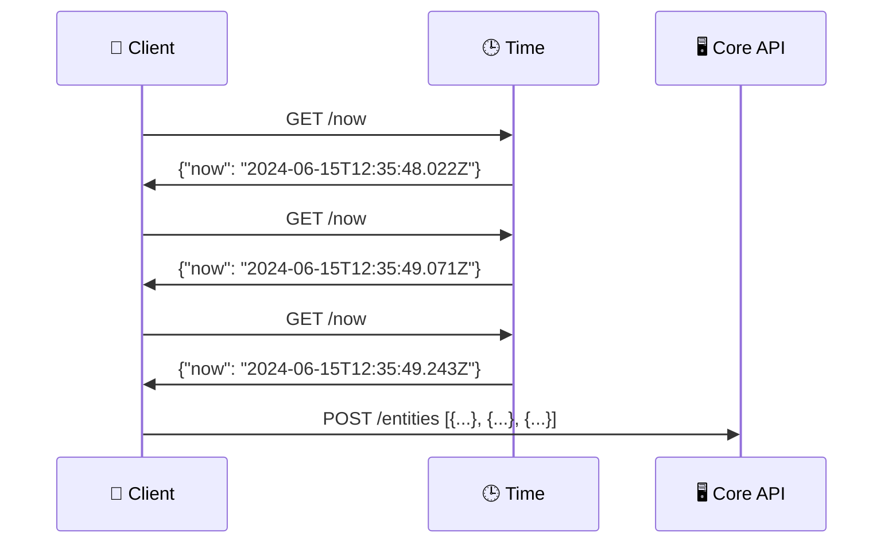

# ⏲️ Beavuck Time

[ ](https://www.npmjs.com/package/beavuck-time)

[ ](https://hub.docker.com/repository/docker/beavuck/time)

## 📊 Status

[](https://sonarcloud.io/summary/new_code?id=beavuck-services_time)

[](https://sonarcloud.io/summary/new_code?id=beavuck-services_time)
[](https://sonarcloud.io/summary/new_code?id=beavuck-services_time)

[](https://sonarcloud.io/summary/new_code?id=beavuck-services_time)
[](https://sonarcloud.io/summary/new_code?id=beavuck-services_time)

[](https://sonarcloud.io/summary/new_code?id=beavuck-services_time)
[](https://sonarcloud.io/summary/new_code?id=beavuck-services_time)
[](https://sonarcloud.io/summary/new_code?id=beavuck-services_time)

[](https://sonarcloud.io/summary/new_code?id=beavuck-services_time)
[](https://sonarcloud.io/summary/new_code?id=beavuck-services_time)

[](https://sonarcloud.io/summary/new_code?id=beavuck-services_time)

---

## 💡 Why

You can't count on client devices to all be set up with the correct date and time.

But keeping track of time is usually busywork, not the business of your core APIs. And you probably don't want to flood
your own APIs, whenever you want to get an accurate timestamp for entities in your apps.

So you can set up this simple microservice, whose only job should be to answer the question: "what time is it right
now?"

---

## 🎯 What

Get the current time in ISO format, in UTC timezone.

This lightweight service focuses on one job.

It needs no persistence layer, is capable of handling multiple concurrent requests, and is protected by a simple
CORS config for security and performance reasons.

Dockerized for easy deployment and scaling.

---

## 🔍 Where

The code lives on [GitLab](https://gitlab.com/beavuck-services/time),
the Docker image is hosted on [Docker Hub](https://hub.docker.com/r/beavuck/time),
and it's also stored as a package on [NPM](https://www.npmjs.com/package/beavuck-time)

### 🦊 GitLab

You can find the code on GitLab, where, once you have read
the [CONTRIBUTING.md](https://gitlab.com/beavuck-services/time/-/blob/main/CONTRIBUTING.md?ref_type=heads) file, you can
also create issues and merge requests.

Feel free to fork the repo and make your own changes at will, as per
the [UNLICENSE](https://gitlab.com/beavuck-services/time/-/blob/main/UNLICENSE?ref_type=heads).

### 🐳 Docker Hub

Most devs will only use Docker Hub for their purposes with this project, to use it as is as a dependency for their own
projects. On Docker Hub, while you're developing, you should use the `beavuck/time:latest` tag to always get the latest
version.

When the time comes to go to production, to protect yourself from surprise breaking changes, you should instead point to
specific minor version tags, such as `beavuck/time:3.0` : those will not get breaking changes, but they will get
security upgrades and bug fixes while they're active.

### Ⓝ NPM

You can also use this service directly via npm:

```bash
npm install beavuck-time
```

#### Programmatically

If you want to run this service programmatically in your Node.js project:

```js
import { startServer } from 'beavuck-time'

startServer({
  hostUrl: 'https://time-api.example.com',
  trustedOrigins: 'https://my.app.com, https://my.app.com/*, https://my-other.app.com, https://my-other.app.com/*',
  apiPort: 3000
})
```

You can rely on environment variables (BEAVUCK_TIME_HOST_URL, etc.) together with (or instead of) passing an options
object. Refer to the Docker Compose example below to see an exhaustive list of available environment variables and what
they do.

#### CLI

To run this service directly in your command line interface, just run:

```bash
npx beavuck-time
```

Refer to the Docker Compose example below to see an exhaustive list of available environment variables and what they do.

---

## ⚙️ Usage

### 🪧 Set up (docker-compose example)

(The section below supposes you're using a Docker image. If using the npm package, you can set those environment
variable
on the host directly, instead of doing so in the container like detailed below)

> **Note:** The Docker image does not include a `.env` file. All configuration must be passed via environment variables
> at runtime.

To run the service in a docker-compose environment, add this in your `docker-compose.yml`'s services section:

```yaml
time:
  image: beavuck/time:latest
  ports:
    - 'SOME_PORT_NUMBER:3000'
    # HOST_PORT:CONTAINER_PORT (Since we are in a container, CONTAINER_PORT corresponds to the API_PORT variable below)
  environment:
    - BEAVUCK_TIME_HOST_URL: https://time-api.example.com
    # BEAVUCK_TIME_HOST_URL: That API's URL. Essential for CORS config.
    - BEAVUCK_TIME_TRUSTED_ORIGINS: https://my.app.com,https://my-other.app.com
    # BEAVUCK_TIME_TRUSTED_ORIGINS: To allow requests from any origin, include * (not recommended). If empty, will only allow requests from the HOST_URL's origin. Defaults to the HOST_URL's origin
    - BEAVUCK_TIME_API_PORT: 3000
    # BEAVUCK_TIME_API_PORT: Optional. Internal port when in a container. Defaults to 3000
    - BEAVUCK_TIME_RATE_LIMIT: -1
    # BEAVUCK_TIME_RATE_LIMIT: Optional. Max allowed number of requests per minute for each IP address. If negative or 0, no limit. Defaults to no limit
    - BEAVUCK_TIME_LOG_LEVEL: info
    # BEAVUCK_TIME_LOG_LEVEL: Optional. Logging levels include error, warn, info, http, verbose, debug, silly. Defaults to info
    - BEAVUCK_TIME_MAX_LOG_FILES: 64
    # BEAVUCK_TIME_MAX_LOG_FILES: Optional. Maximum number of logs to keep. This can be a number of files or number of days. If using days, add 'd' as the suffix. Default is 64
    - BEAVUCK_TIME_MAX_SIZE_LOG_FILES: 1m
    # BEAVUCK_TIME_MAX_SIZE_LOG_FILES: Optional. Maximum size of the file after which it will rotate. This can be a number of bytes, or units of kb, mb, and gb. If using the units, add 'k', 'm', or 'g' as the suffix. The units need to directly follow the number. Default is 1m
```

Here's the simple docker compose file I used to test this service locally:

```yaml
services:
  time:
    image: beavuck/time:latest
    ports:
      - '3000:3000'
    environment:
      BEAVUCK_TIME_HOST_URL: http://127.0.0.1:3000
      BEAVUCK_TIME_TRUSTED_ORIGINS: http://127.0.0.1:8000,http://localhost:8000
      BEAVUCK_TIME_LOG_LEVEL: debug
```

When you're ready, just run your services with:

```shell
docker compose up -d
```

### ✨ Using the service

Now, when you run:

```
curl --location 'http://localhost:{{SOME_PORT_NUMBER}}/now' \
--header 'Origin: {{SOME_TRUSTED_ORIGIN}}'
```

you should expect an answer such as:

```json
{
  "now": "2024-06-15T12:35:48.022Z"
}
```

---

## 🛡️ CORS

This service is protected by a CORS policy, which you can configure by setting the `TRUSTED_ORIGINS` environment
variable.

When you use the API, keep in mind what roles these headers play:

| `"Origin:"`                                               | `"Referrer:"`*                 | Result |
|-----------------------------------------------------------|--------------------------------|--------|
| Defined and API `BEAVUCK_TIME_TRUSTED_ORIGINS` set to `*` | Whatever                       | ✅      |
| Trusted                                                   | Whatever                       | ✅      |
| Same as this API's host                                   | Whatever                       | ✅      |
| Not defined                                               | Same as this API's host        | ✅      |
| Defined and not trusted                                   | Whatever                       | 🛑     |
| Not defined                                               | Not defined                    | 🛑     |
| Not defined or not trusted                                | Different from this API's host | 🛑     |

*AKA `Referer` (sic).

---

## 📚 Use cases

### Batch `POST`s

Suppose you're creating timestamped entities in your app, and you want to send them in a batch to your API. Your API
knows the current time when it gets the request, but not the creation time of each entity.



And querying your core API for the current time for each entity is a waste of resources -- that's why you're batching
the operation in the first place.



So you can use this service to get the current time whenever you need it, and use that as the creation time for each
entity.



---

## 📜 License

Have at it.

This project uses the Unlicense. See
the [UNLICENSE](https://gitlab.com/beavuck-services/time/-/blob/main/UNLICENSE?ref_type=heads) file for details.
